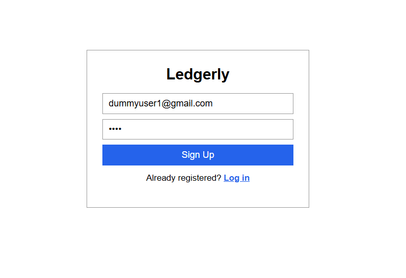
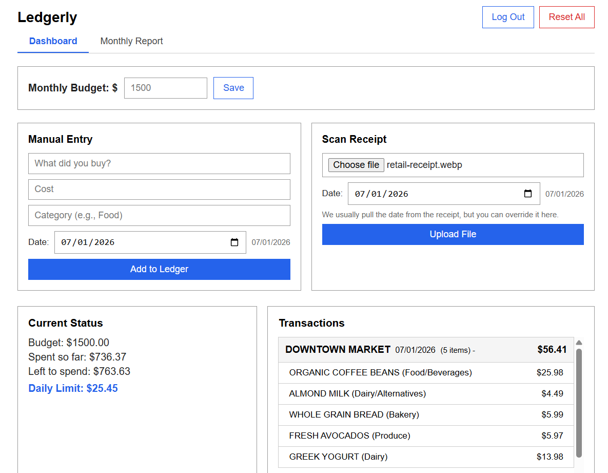
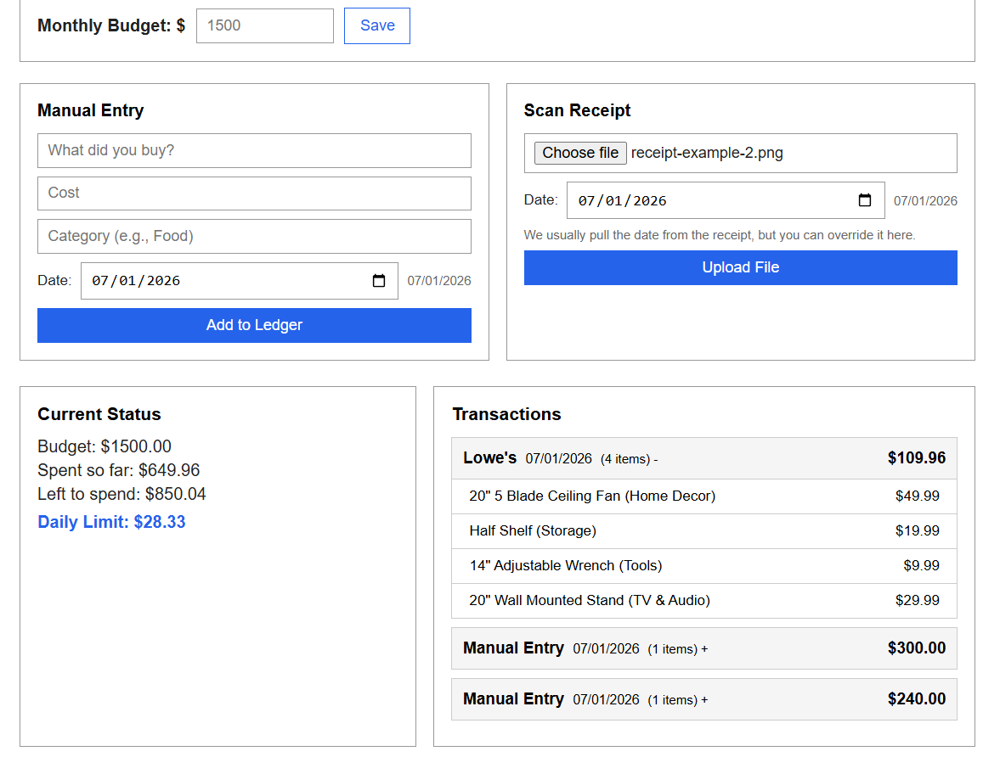
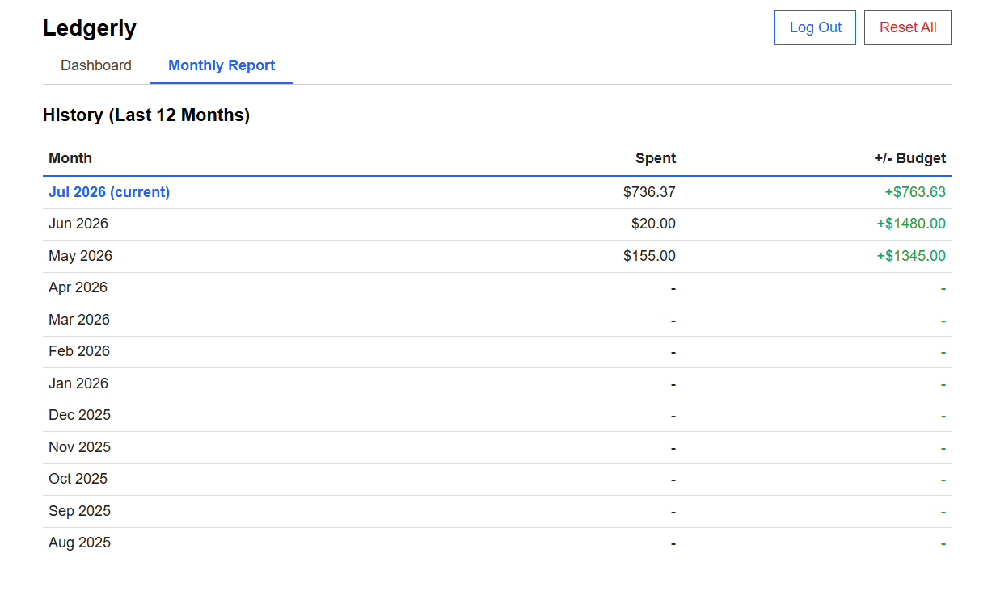

# Ledgerly — AI-Powered Expense Tracker

A full-stack personal finance web app that uses AI to scan receipts, track spending, and calculate an optimized daily budget.

---

## Screenshots

### Login Screen


### Dashboard


### Receipt Upload


### Monthly Report


---

## Features

- **AI Receipt Scanning** — Upload a photo of any bill or receipt. The AI reads every line item, price, and category automatically and adds them all to your expense history
- **Manual Entry** — Add expenses manually with item name, amount, category, and date
- **Per-User Accounts** — Secure signup and login. Every user's data is completely private and separate
- **Smart Budget** — Set a monthly budget. The app calculates how much you can safely spend per day based on what's left
- **Monthly Report** — Table showing your total spending for each of the last 12 months, and whether you were over or under budget
- **Grouped Transactions** — Each receipt shows as one entry. Click to expand and see every individual item inside it

---

## Tech Stack

| Layer | Technology |
|---|---|
| Frontend | React, Vite |
| Backend | FastAPI (Python) |
| Database | SQLite via SQLAlchemy ORM |
| AI / Vision | Groq LLaMA 4 Scout (receipt parsing) |
| Auth | JWT tokens + bcrypt password hashing |
| Optimization | Google OR-Tools GLOP linear solver |
| Containerization | Docker |

---

## Running Locally

### Prerequisites
- [Docker Desktop](https://www.docker.com/products/docker-desktop/) installed and running
- A free Groq API key from [console.groq.com/keys](https://console.groq.com/keys)

### Setup

**1. Clone the repository:**
```bash
git clone https://github.com/vinitchoubey/ledgerly.git
cd ledgerly
```

**2. Create your secrets file:**
```bash
cp backend/.env.example backend/.env
```

Open `backend/.env` and fill in:
```
GROQ_API_KEY=your_groq_key_here
SECRET_KEY=your_secret_key_here
```

**3. Generate a SECRET_KEY:**
```bash
openssl rand -hex 32
```
Paste the output as `SECRET_KEY` in `backend/.env`.

**4. Start the app:**
```bash
bash run.sh
```

**5. Open in browser:**
```
http://localhost:5173
```

Sign up for an account and start tracking.

---

## Project Structure

```
ledgerly/
├── backend/
│   ├── main.py          # FastAPI routes and business logic
│   ├── auth.py          # JWT login, signup, password hashing
│   ├── database.py      # SQLAlchemy models (User, Expense)
│   ├── requirements.txt
│   ├── Dockerfile
│   └── .env.example     # Template for secrets (copy to .env)
├── frontend/
│   ├── src/
│   │   └── App.jsx      # Full React frontend (single file)
│   ├── Dockerfile
│   └── package.json
├── run.sh               # Builds and starts both Docker containers
└── README.md
```

---

## How the AI Receipt Scanning Works

1. User uploads a photo of a receipt
2. The image is base64-encoded and sent to the backend
3. FastAPI forwards it to the Groq LLaMA 4 Scout vision model with a structured prompt
4. The model returns JSON with the shop name, date, and every line item with its price and category
5. The backend validates and stores each item under the logged-in user's account
6. The frontend refreshes to show the new grouped transaction entry

---

## How the Daily Budget Optimization Works

The app uses **Google OR-Tools GLOP linear solver** to answer:
> "Given my remaining budget and days left in the month, what is the maximum I can spend per day without going over?"

This is a simple but real linear programming problem:
- Variable: `daily_spend`
- Constraint: `daily_spend × days_remaining ≤ remaining_budget`
- Objective: maximize `daily_spend`

---

## Notes

- The app runs entirely locally via Docker — no cloud hosting required to try it
- Data is stored in a SQLite file inside the backend container (persisted via Docker volume)
- Secrets (`GROQ_API_KEY`, `SECRET_KEY`) are never committed — managed via `backend/.env` which is gitignored
